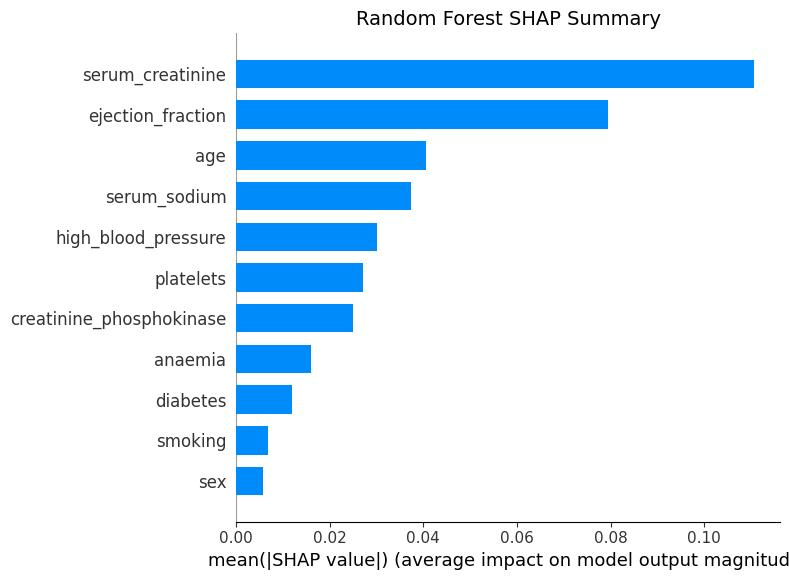
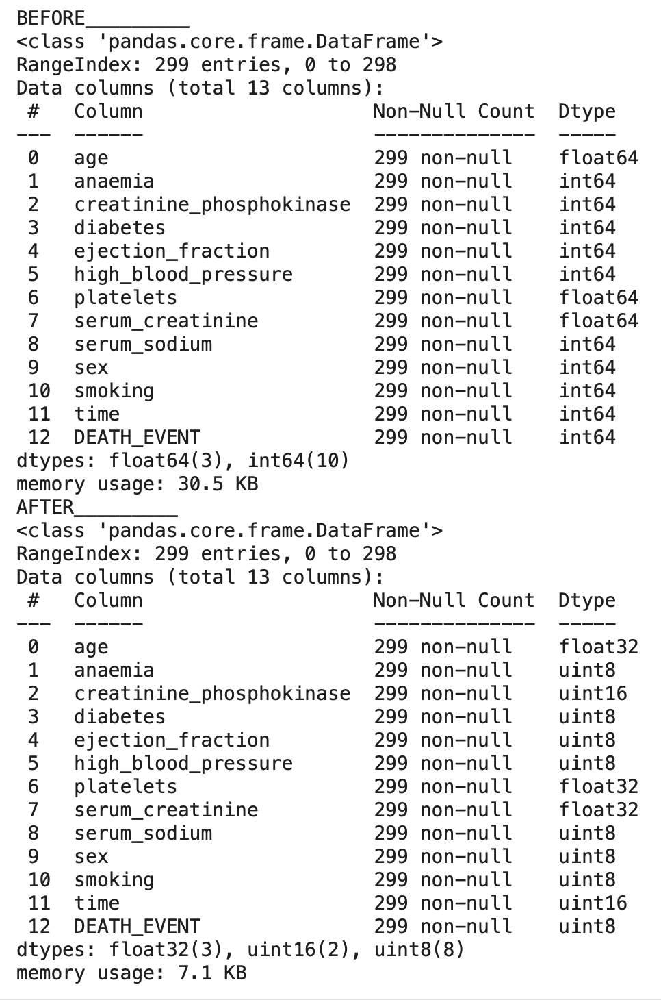

# Coding week_group 7 : Medical Decision Support Application
# PROJECT 1 : predicting heart failure risk with explainable ML SHAP
  This project aims to enhance clinical decision-making by providing an **explainable machine learning model** for predicting heart failure risk. By leveraging **SHAP (Shapley Additive Explanations)**, our approach ensures **transparency and interpretability**, allowing physicians to understand the reasoning behind each prediction. The system is designed to be **efficient, user-friendly, and professionally deployed**, featuring a **Streamlit or Flask interface** for seamless interaction. Additionally, best software development practices, including **CI/CD automation**, are incorporated to ensure a robust and scalable solution.
## Objectives :
- Develop a robust and accurate machine learning model to predict heart failure risk.
- Ensure model interpretability using SHAP (Shapley Additive Explanations) for transparent decision-making.
- Design an intuitive user interface with Streamlit or Flask for seamless interaction.
- Optimize memory usage to improve efficiency and scalability.
- Implement a CI/CD pipeline with GitHub Actions for automated testing and deployment.
- Apply prompt engineering techniques to enhance AI-driven workflows and documentation.
## Installation and Run Project :
If you would like to run this project, follow the steps below to set it up on your local machine.

### Clone the Repository

- Go to the project repository.
- Clone the repository: clone it to your local machine. You can do this with the following steps:

- Navigate to the repository page.

- Copy the repository URL: https://github.com/username/Coding-week_gr7_PREDICTING-HEART-FAILURE-RISK-WITH-EXPLAINABLE-ML-SHAP.git (replace username with your GitHub username).

- Open your terminal and navigate to the folder where you want to store the project.

- Run the following command to clone the repository:

```git clone https://github.com/username/Coding-week_gr7_PREDICTING-HEART-FAILURE-RISK-WITH-EXPLAINABLE-ML-SHAP.git```

### Set Up the Environment
It’s a good practice to set up a virtual environment to avoid conflicts with other Python packages you have installed. Follow these steps to create a virtual environment:

### Install Virtualenv (if not installed): If you don't have virtualenv installed, install it via pip:

```pip install virtualenv```

### Create a virtual environment:

In your terminal, navigate to the project directory (where requirements.txt is located) and create a virtual environment:

```virtualenv venv```

### Activate the virtual environment:

#### On macOS/Linux:

```source venv/bin/activate```

#### On Windows:

```venv\Scripts\activate```

### Install Project Dependencies
Now that your virtual environment is set up, install the required Python libraries and dependencies using the requirements.txt file.

Ensure you're in the project directory where the requirements.txt file is located.

Run the following command to install all dependencies:

```pip install -r requirements.txt```

### Prepare the Data
For this project, you will need to have the dataset used in the project. The dataset is heart_failure_clinical_records_dataset.csv.

Download the dataset: You can find the dataset by following the link below:

https://archive.ics.uci.edu/dataset/519/heart%2Bfailure%2Bclinical%2Brecords

Place the dataset: Place the downloaded CSV file in the project directory or the folder specified in the code.

### Running the Project
Once everything is set up, you can run the project.

Running the Python Script
You can execute it by running:

```python main.py```
Running with Jupyter Notebook
If the project includes Jupyter Notebooks (with .ipynb files), you can also run them for an interactive experience. Here's how to do it:

Install Jupyter Notebook (if it's not already installed) by running the following command:

```pip install notebook```

Start Jupyter Notebook by running the command:

```jupyter notebook```

This will open Jupyter Notebook in your browser. You should see the project files there. Click on the appropriate notebook file (e.g., ```heart_failure_analysis.ipynb```) to open it.

Execute the cells in the notebook:

You can run the notebook cells one by one by pressing ```Shift + Enter``` or using the Run button in the Jupyter interface.

#### **Note:**    
When using this program, you should adapt it to your system, especially the file paths, when downloading or accessing the datasets. Make sure to modify the paths for the files (such as ```heart_failure_clinical_records_dataset.csv```, ```X_train_resampled.csv```, etc.) to match the location on your machine where the files are stored.

### Troubleshooting
If you encounter issues during the setup or execution of the project, here are a few steps to resolve common problems:

Missing dependencies: Ensure all libraries are installed. You can check this by running:

```pip list```

This will list all installed packages. If you notice a missing package, you can install it using pip.

Dataset Issues: Ensure the dataset is properly downloaded and placed in the expected location. If the code references a specific path, make sure the dataset is placed there.


### Summary of Key Commands
To summarize, here are the key commands you need to follow to set up and run the project:

#### Clone the repository:

```git clone https://github.com/username/Coding-week_gr7_PREDICTING-HEART-FAILURE-RISK-WITH-EXPLAINABLE-ML-SHAP.git```

#### Create a virtual environment:

```virtualenv venv

source venv/bin/activate  # macOS/Linux

venv\Scripts\activate  # Windows 
```
#### Install dependencies:

```pip install -r requirements.txt ```

#### Run the Python script:

```python main.py```

#### Run Jupyter Notebook:

```jupyter notebook```


  ---

## Data Preprocessing Pipeline - Heart Failure Dataset
This repository provides a data preprocessing pipeline for the heart failure clinical records dataset, aimed at preparing the data for machine learning model training. The preprocessing steps include outlier detection and handling, transformations on continuous variables, and class imbalance handling. This README describes the process in detail.

#### 1. What is the purpose of the code?
The purpose of this code is to preprocess the Heart Failure Clinical Records Dataset for machine learning model training. The main goals are:

##### **Outlier detection and handling:**  
Outliers are identified and dealt with using methods like Box-Cox transformations and Winsorization to ensure data quality.
##### Data transformation:
Skewed features are transformed using Box-Cox to normalize them.
##### Feature standardization: 
Continuous features are standardized to have a mean of 0 and a standard deviation of 1, ensuring better model performance.
##### Addressing class imbalance: 
The Synthetic Minority Over-sampling Technique (SMOTE) is applied to balance the dataset by generating synthetic data for the minority class (```DEATH_EVENT = 1```).
Data splitting: The dataset is split into training and test sets, with 80% used for training and 20% used for testing.

#### 2. Which dataset is used?
The code uses the Heart Failure Clinical Records Dataset, which contains clinical data about heart failure patients. The dataset includes features such as age, sex, blood pressure, serum levels, and medical conditions. The target variable is ```DEATH_EVENT```, which indicates whether the patient experienced a death event (1) or not (0) within a given timeframe.

#### 3. What are the key steps of the preprocessing pipeline?

<p align="center">
  
</p>


#### 4. What does the transform_input_data function do?
The ```transform_input_data``` function is designed to apply the same transformations to new input data that were applied to the training data. Specifically, it performs the following:

Box-Cox Transformation: Applies the same Box-Cox transformation to continuous features, using precomputed lambda values from the training data.
Winsorization: Caps extreme values in the ```platelets``` feature based on the original dataset's 5th and 95th percentiles.
Standardization: Standardizes input data using the precomputed mean and standard deviation of the transformed training data to ensure consistency across datasets.
This function allows the model to handle new data in the same manner as the training data, ensuring the model remains consistent when making predictions on unseen data.

#### 5. Was the dataset balanced? If not, how did you handle imbalance? And what was the impact?
The dataset was imbalanced, with a lower proportion of death events (```DEATH_EVENT = 1```). To address this issue, the SMOTE (Synthetic Minority Over-sampling Technique) was applied to generate synthetic samples for the minority class. This helped balance the dataset by increasing the number of instances of the minority class, improving the model’s ability to learn patterns related to both classes and preventing bias toward the majority class.

Impact: The SMOTE application likely improved the model's ability to predict death events accurately, as the model was trained on a more balanced dataset.

#### 6. Which ML model performed best? Provide performance metrics.
The Random Forest Classifier was the most performant model. It showed the best accuracy and overall performance compared to other models. The Random Forest classifier is robust and performs well even when dealing with imbalanced data, as it can learn complex patterns and handle outliers effectively.

##### Performance metrics:
- **Accuracy:**      High accuracy on both the training and test datasets, demonstrating good generalization.
- **Precision, Recall, F1-Score:**   These metrics indicate that the model achieved a good balance between identifying both classes (```DEATH_EVENT = 1``` and ```DEATH_EVENT = 0```).

#### 7. Which medical features most influenced predictions (SHAP results)?
Based on the SHAP analysis, the following features had the most significant impact on the model’s predictions for DEATH_EVENT:

- **Serum Creatinine:** This feature had the highest influence, contributing the most to the model’s decision-making process.
- **Ejection Fraction:** The percentage of blood pumped out of the heart was the second most influential feature.
- **Age:** The patient's age also played a significant role in the predictions, with older age contributing notably to the likelihood of a death event.
- **Serum Sodium:**   This feature, which is indicative of fluid balance in the body, also played a substantial role in predicting death events.

<p align="center">
  
</p>


These rankings are based on the SHAP values, which quantify how much each feature contributes to the model's output.

#### 8. What insights did prompt engineering provide for your selected task?
Prompt engineering did not directly apply to the dataset or the machine learning model in this project, as the focus was on traditional data processing, preprocessing, and model training. However, in a broader context, prompt engineering can be used for tasks involving natural language processing or when interacting with models that require specific input formatting.

In this project, the key insights came from the data exploration and feature engineering steps, which ensured that the data was clean, balanced, and properly transformed for model training. Additionally, the identification of key features that influence the target variable (```DEATH_EVENT```) through SHAP values provided valuable insights into which clinical measurements were most relevant for prediction.

  ---

## Memory Optimization with ```optimize_memory()``` Function

### Overview
The goal of this section is to introduce and explain the ```optimize_memory(df)``` function, which optimizes the memory usage of a dataset by downcasting numeric columns to more efficient data types. This optimization process is crucial for working with large datasets, as it reduces memory consumption and makes data processing more efficient. By minimizing memory usage, it also helps improve the performance of data processing tasks, especially when handling large datasets that may not fit into memory otherwise.

### Dataset and Function Overview
#### Function: ```optimize_memory(df)```
The ```optimize_memory``` function takes a pandas DataFrame as input and performs memory optimization on its numeric and object columns. It returns a new DataFrame that is memory-optimized while maintaining the integrity of the data.

Steps Involved in the Optimization Process

1. Reading the Dataset:
The dataset ```heart_failure_clinical_records_dataset.csv``` is loaded into a pandas DataFrame. The ```time``` and ```Unnamed: 0``` columns are dropped (if present), as they are not necessary for the optimization process.

2. Optimizing Numeric Columns:
The function evaluates the data type of each numeric column and performs the following optimizations:

##### Integers:
The function checks the minimum and maximum values in each integer column and downcasts it to the smallest integer type that can hold the values. For example, it converts ```int64``` to ```int32``` or ```int16``` based on the range of the values.
##### Floats:
If the values in the float column fall within the range of ```float32```, the column is downcasted from ```float64``` to ```float32``` to reduce memory consumption.

3. Optimizing Object Columns:    
For columns with object data types (usually strings), the function converts them to the ```category``` data type if the number of unique values is small relative to the total number of rows. This is particularly beneficial when the column has many repeated values, as it reduces memory usage.

4. Memory Usage Calculation:    
Before performing any optimizations, the function measures the memory usage of the original DataFrame. After the optimizations are applied, the memory usage is measured again. The reduction in memory usage is displayed as a percentage, which shows the effectiveness of the optimization process.

### Memory Usage Before and After Optimization
The function reports the memory usage of the DataFrame before and after the optimization. This allows you to see how much memory was saved as a result of the optimizations. The difference is presented as a percentage reduction in memory usage, helping to demonstrate the effectiveness of the function.

#### Example Output:  
**Memory usage before optimization:**   30.5 KB 
**Memory usage after optimization:**  7.1 KB
**Memory reduced by:**   76.60%

<p align="center">
  
</p>

### Expected Outcomes
By applying the ```optimize_memory``` function, you can expect:

A significant reduction in memory usage.
A memory-efficient DataFrame that consumes the least amount of memory without compromising data integrity.
The ability to handle larger datasets more effectively.
Faster data processing due to the reduced memory footprint.

  ---
  
## Prompt engineering documentation
Here are the exact prompts we used to ask for the functionality, and the corresponding responses Chatgpt provided:

##### Prompt 1:
"I have a large dataset and I'm concerned about memory usage. Could you help me optimize the memory usage for a Pandas DataFrame?"

##### Response:
He provided the optimize_memory function, which intelligently adjusts the data types of the DataFrame columns, converting them into more memory-efficient formats to reduce the overall memory footprint for large datasets.

##### Prompt 2:
"Can you explain how this memory optimization actually works and which specific data types are being optimized?"

##### Response:
He explained that the function works by analyzing each column's range of values and downcasting numeric columns to smaller types (e.g., from int64 to int32 or float64 to float32). Additionally, for object columns, he noted how they can be converted to the category data type if it leads to more efficient memory usage, ensuring accuracy and data integrity.

##### Prompt 3:
"How can I check the improvement in memory usage before and after optimization? Can you provide an example of how this would be done?"

##### Response:
He detailed how the function calculates and prints the memory usage before and after optimization, including the exact memory used in megabytes and the percentage of memory reduction. He also shared sample output to show how you can evaluate the improvement effectively.

##### Prompt 4:
"What will happen to my data if I use this optimization function? Will it affect the accuracy or integrity of the data?"

##### Response:
He reassured you that the optimization function maintains the accuracy and integrity of the data. By downcasting to smaller types, it selects the most appropriate data type for each column, ensuring no loss of information. This is especially critical for numeric data, where precision is maintained.

  ---

## Explanation of the Streamlit Interface


   
This interactive web application, developed using Streamlit, allows users to input a patient's health data and predict their mortality risk using a machine learning model trained with Random Forest. Below is a detailed explanation of the different components of the interface:

### Model Loading
The application loads the pre-trained Random Forest model from a ```.joblib ``` file. This model is used to predict whether a patient is at risk of death based on their health characteristics.
The application loads the pre-trained Random Forest model from a .joblib file. This model is used to predict whether a patient is at risk of death based on their health characteristics.

### Interface Customization
Custom styles are applied to the interface using CSS. This includes a stylish background with a gradient overlay, buttons with hover effects, neat input fields, and harmonious colors that make the interface pleasant to use.

### Title and Layout
The application displays a centered title, "Prediction of Death Event using Advanced Machine Learning Model," in a large font with a text-shadow effect, to grab the user's attention and make the interface more engaging. The title is followed by a section for entering patient data.

### Data Loading
The application loads a dataset (```heart_failure_clinical_records_dataset.csv```) containing information about patients in relation to death events. If the file is not found, an error message is displayed, and the app stops.

### Data Input
Users can enter various patient information, such as age, serum creatinine, ejection fraction, etc., through text fields, numeric input fields, and radio buttons. The input data is structured neatly in three columns for better readability.

### Data Transformation
Once the data is entered, it undergoes transformations using predefined preprocessing steps:

#### Box-Cox transformation is applied to continuous features such as serum creatinine and serum sodium to normalize the data.
#### Winsorization (clipping extreme values) is used for the platelets variable.
#### Standardization of continuous variables to make them comparable (using the mean and standard deviation from the training dataset).

### Prediction
Once the data is transformed, the Random Forest model is used to make predictions. The model returns two results:

The predicted class (1 for a death event, 0 for survival).
The probabilities for both classes (death and survival).

### Displaying Results
Depending on the prediction, the application displays the results as the mortality risk probability and survival probability in percentage. A health status of the patient is also shown, indicating whether the patient is critical or stable. If the mortality risk is high, an error message appears; otherwise, a success message is shown, recommending regular monitoring of the patient.

### Feature Importance
The app also attempts to load and display an image explaining the importance of different features in predicting mortality risk. This helps users understand which factors have the greatest influence on the model’s decision.

### Data Summary
Finally, a summary table is displayed, showing the data entered by the user. This allows the user to review the input before making any decisions.

### Final Interaction
The user can click a button to trigger the prediction. Once the "Predict Mortality Risk" button is pressed, the application performs all the preceding steps, computes the prediction, and displays the results on the interface.


  ---
  
## Step-by-Step Guide to Execute the Interface
To successfully run the interface, follow these steps. You must have already installed the required packages beforehand and have access to the dataset from the provided Google Drive link.

### 1. Install Requirements

Before starting, ensure that the necessary libraries are installed. You can do this by running the following command in your terminal:

```pip install -r requirements.txt```

This command installs all the dependencies listed in the ```requirements.txt``` file.

### 2. Download the Dataset

You will need the dataset for this project. Download it from the provided Google Drive link:

Google Drive Link: https://drive.google.com/drive/folders/13FnPhAoj5JJkwksqActUbvg_jtC1pKIx?usp=share_link

Download the folder containing the dataset and related files.

### 3. Adjust the Path in the Data File

After downloading the dataset, you need to adjust the file path in the project files to point to the location where you saved the dataset on your computer.

Locate the ```data``` file in the project directory.
Open the file and modify the path to match the location on your computer. For example, if you downloaded the folder to ```C:\Users\YourName\Downloads\project_folder```, adjust the path accordingly.

Make sure to insert the full path to the dataset location on your system.

### 4. Open Command Prompt (Administrator Mode)

For proper permissions and smoother operation, open the Command Prompt in Administrator Mode:

Press the ```Windows key``` and search for "Command Prompt".
Right-click on "Command Prompt" and select Run as Administrator.

### 5. Run the Application

Once the dataset is downloaded, the path is correctly set, and the requirements are installed, navigate to the project folder in your command prompt.

Use the ```cd``` command to navigate to the folder containing your project and the ```app.py``` file:

```cd path\to\your\project```

Replace ```path\to\your\project``` with the actual path to your project folder.

Run the Streamlit app with the following command:

```streamlit run app.py```

This will launch the interface and open it in your default web browser.

You have now successfully set up and launched the interface. If you encounter any issues with file paths, ensure that the dataset path is correct and that all required libraries are installed as described in the requirements.txt file.

## Credits
The authors of this project are:

#### Ammour Adam
#### Assouabi Imad
#### Desmoulins Lucien
#### Ouamalich Aasmaa
#### Tahri Abdelouahed 


